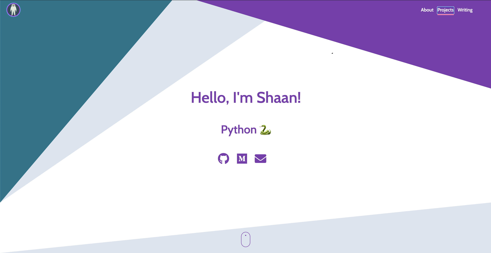
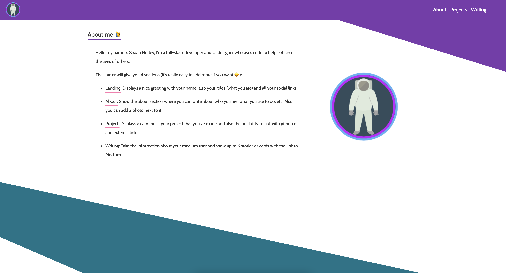
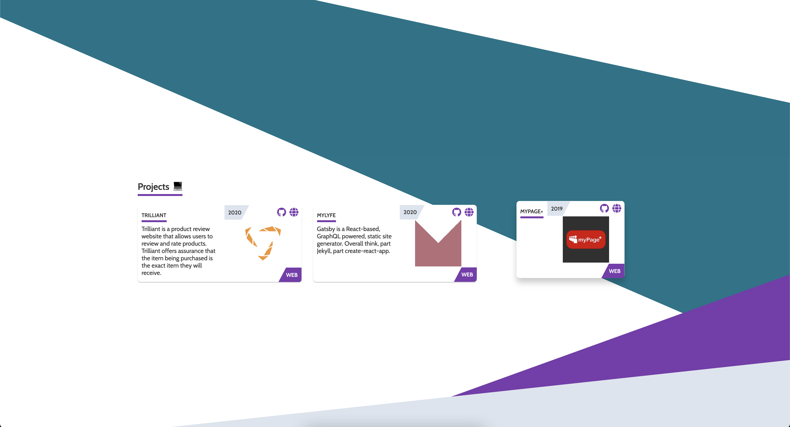
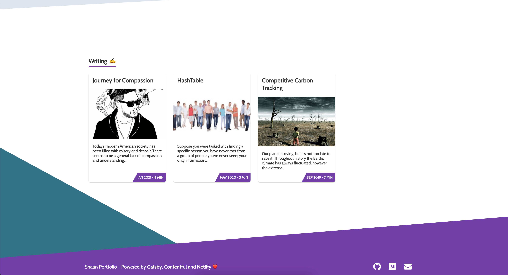

# Shaan's Portfolio

[](https://travis-ci.com/EmaSuriano/gatsby-starter-mate)
[](https://eslint.org/)
[](https://github.com/prettier/prettier)

[](https://percy.io/Ema-suriano/gatsby-starter-mate)
[](https://app.netlify.com/sites/gatsby-starter-mate/deploys)


The target audience are Developers 💻 and Tech Writers ✍️.

### [Check the Demo ✨](https://gatsby-starter-mate.netlify.com/)


## Why? 🤔

In case you are looking for a quick setup portfolio or upgrade your current, you have to definitely try Mate!

This starter is totally content based on [Contentful](https://contentful.com), which is a headless CMS where you can write the content for your page. In summary, Contentful is the Model when Gatsby with React is the View.

At the same time, as this portfolio is written with Gatsby is extremely easy to add more than one source of data! For example, the demo comes with an integration of [Medium](https://medium.com) posts based on a user name ✌️

## Features 🛠

- [Gatsby](https://www.gatsbyjs.org/)
- [Rebass](https://rebassjs.org/): styled component system
- [React Awesome Reveal](https://github.com/dennismorello/react-awesome-reveal)
- Typescript
- CMS Integration with [Contentful](https://contentful.com)
- PWA ready
- SEO
- Responsive design
- Icons from [font-awesome](https://fontawesome.com/)
- [Netlify](https://www.netlify.com) Deployment Friendly
- Medium integration
- Social sharing (Twitter, Facebook, Google, LinkedIn)
- Developer tools:
  - `eslint`
  - `prettier`
- Google Analytics integration
- End to End with Cypress:
  - A11y testing with [Axe](https://www.deque.com/axe/)
  - Visual Testing with [Percy](https://percy.io/)


## Screenshot and Design 🖼

As the starter is a SPA it only has two routes:

- `/`: main page with the sections of `Home`, `About me`, `Projects` and `Writing`.
- `/404`: error page for unexpected route.

| Section  |                            Screenshot                            |
| -------- | :--------------------------------------------------------------: |
| Home     |       |
| About me |     |
| Projects |  |
| Writing  |    |


## Building your site 📦

As we are dealing with environment variables, the `.env` file is excluded from `.gitignore` file. Therefore, in order to deploy the website you have to send `SPACE_ID` and `ACCESS_TOKEN` with the `build` command.

```bash
SPACE_ID=xxxxx ACCESS_TOKEN=yyyyy yarn build
```

The result will be stored inside the `public` folder, so you can upload to your web host. I highly suggest using this starter with Netlify when you can define which command will build the project and also send the environment variables inside the website configuration.

